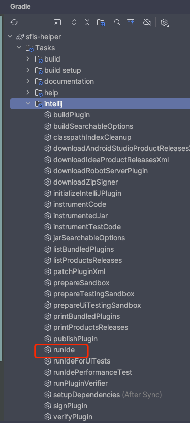

# Sfis-helper

## Intro

IntelliJ plugin study project

Work toolset for myself

## Usage

- [runIde](https://plugins.jetbrains.com/docs/intellij/tools-gradle-intellij-plugin.html#tasks-runide)

Run the IDE instance with the developed plugin installed.

runIde task extends the JavaExec Gradle task – all properties available in the JavaExec as well as the following ones can be used to configure the runIde task.

- [buildPlugin](https://plugins.jetbrains.com/docs/intellij/tools-gradle-intellij-plugin.html#tasks-buildplugin)

generate zip file to share or install in the path "build/distributions/xxxxx.zip"

## References

[https://plugins.jetbrains.com/docs/intellij/welcome.html](https://plugins.jetbrains.com/docs/intellij/welcome.html)

[https://kotlinlang.org/docs/home.html](https://kotlinlang.org/docs/home.html)

[https://www.ideaplugin.com/idea-docs/](https://www.ideaplugin.com/idea-docs/)

[IDEA插件开发](https://www.bilibili.com/video/BV1Zi4y1b7fw/?share_source=copy_web&vd_source=c71c79a0e59361cee136f3f1c1b16180)

[直播回放 | 9月29日「JetBrains码上道」| 主题：从零开始，开发插件](https://www.bilibili.com/video/BV1rv4y147fb/?share_source=copy_web&vd_source=c71c79a0e59361cee136f3f1c1b16180)